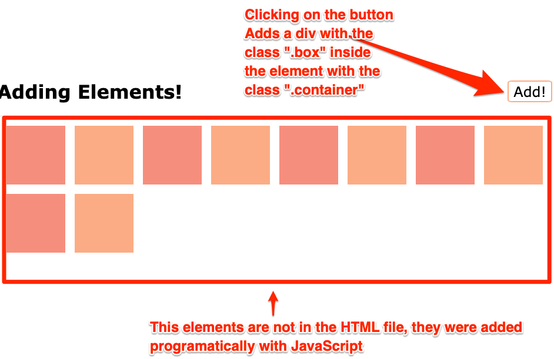

# Exercise 1: Adding Elements

When clicking on the "Add" button, new divs with the class `.box` should be created an appended to the `.container` element.

## Resources

- [JavaScript Info: Summary of creation and insertion methods](https://javascript.info/modifying-document#summary)
- [MDN: createElement](https://developer.mozilla.org/en-US/docs/Web/API/Document/createElement)
- [MDN: click event](https://developer.mozilla.org/en-US/docs/Web/API/Element/click_event#javascript)
