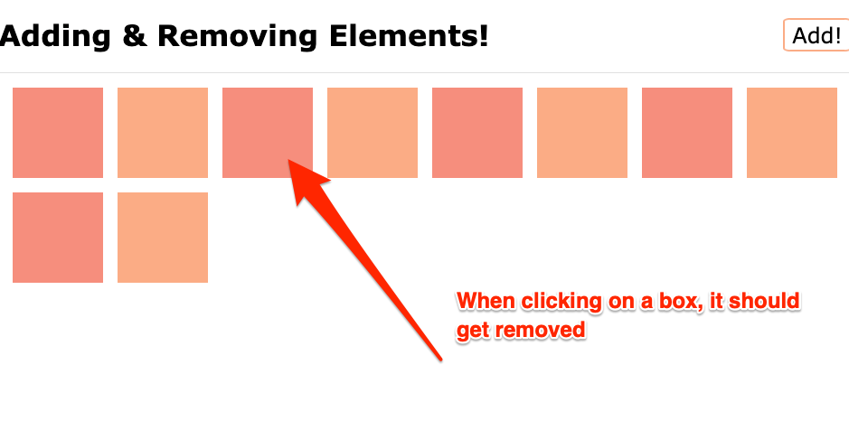

# Exercise 2: Removing Elements

Using the previous exercise as base, let's now add interactive elements to the `.container`.

When the user clicks one of the boxes, we should remove the clicked box

## Extra Challenge

Removing is a destructive operation. Right now, once the user clicks the box, it's gone.
Let's ask the user first, if they are sure about their decision. They should `confirm` it, and after that we can safely remove it.

## Resources

- [JavaScript Info: Summary of creation, removal and insertion methods](https://javascript.info/modifying-document#summary)
- [MDN: createElement](https://developer.mozilla.org/en-US/docs/Web/API/Document/createElement)
- [MDN: remove](https://developer.mozilla.org/en-US/docs/Web/API/ChildNode/remove#using_remove)
- [MDN: click event](https://developer.mozilla.org/en-US/docs/Web/API/Element/click_event#javascript)
