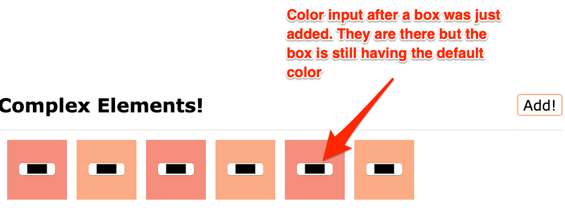
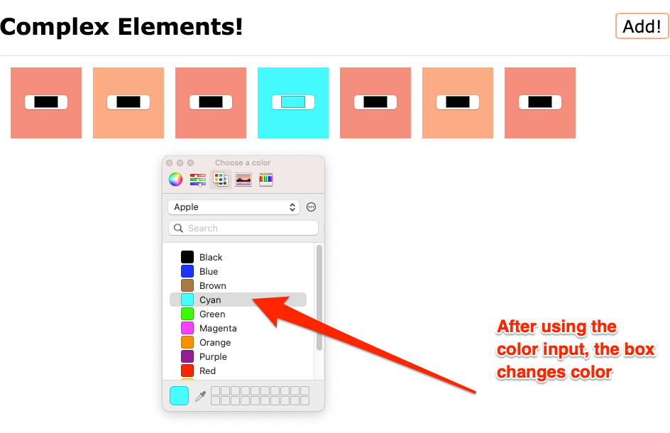

# Exercise 3: Complex Elements

Using the first exercise as base, let's now add interactive elements to the `.container`.

We want to add boxes that contain inside a color input that we can use to change the color of the box.

## Resources

- [JavaScript Info: Summary of creation, removal and insertion methods](https://javascript.info/modifying-document#summary)
- [MDN: createElement](https://developer.mozilla.org/en-US/docs/Web/API/Document/createElement)
- [MDN: click event](https://developer.mozilla.org/en-US/docs/Web/API/Element/click_event#javascript)
- [MDN: Input Type Color](https://developer.mozilla.org/en-US/docs/Web/HTML/Element/input/color)
