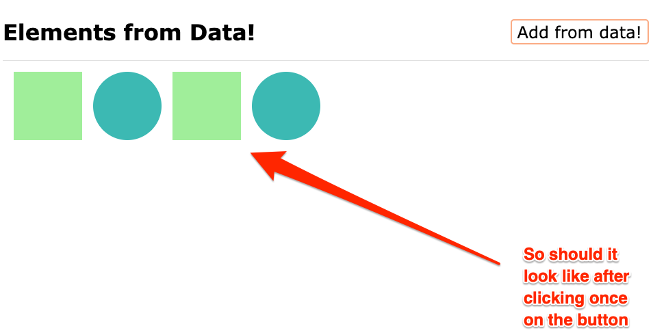

# Exercise 4: Adding Elements from Data

When clicking on the "Add From Data" button, new divs should be created an appended to the `.container` element.

In the `solution.js` file, you have an array of objects containing data defining which class and background color the elements added should have.

## Resources

- [JavaScript Info: Summary of creation and insertion methods](https://javascript.info/modifying-document#summary)
- [MDN: createElement](https://developer.mozilla.org/en-US/docs/Web/API/Document/createElement)
- [MDN: click event](https://developer.mozilla.org/en-US/docs/Web/API/Element/click_event#javascript)
